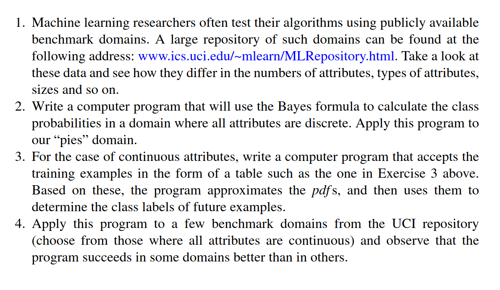
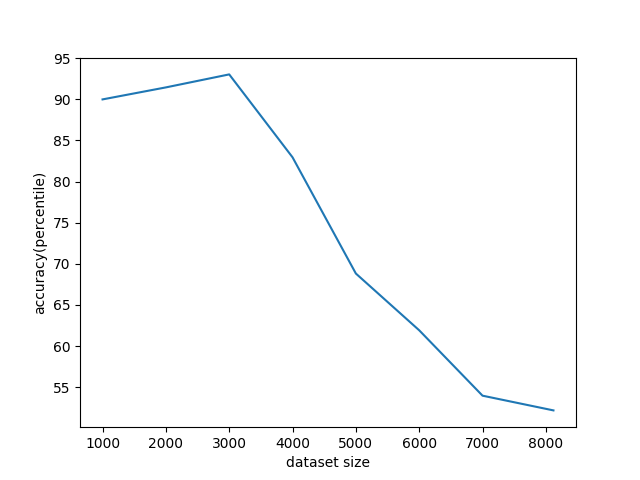

# Chapter2: Bayesian Classifiers
### Computer Assignments

### Results
##### Discrete Bayesian Classification (assignment 2)
	I used this UCI dataset: https://archive.ics.uci.edu/ml/datasets/Mushroom . I changed it a little bit
	and made eight different subsets of the whole dataset with sizes 1000, 2000, ..., 8120 examples. 
	Then relabeled each subfile. Here are the results: 

