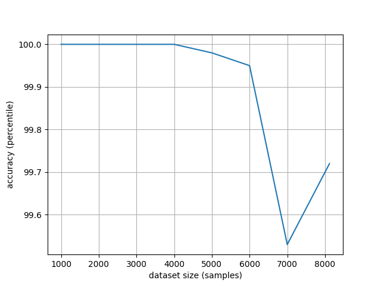

# Chapter2: Bayesian Classifiers
### Computer Assignments

### Results
##### Discrete Bayesian Classification (assignment 2)
	I used this UCI dataset: https://archive.ics.uci.edu/ml/datasets/Mushroom . I changed it a little bit
	and made eight different subsets of the whole dataset with sizes 1000, 2000, ..., 8120 examples. 
	Then relabeled each subfile, meaning I took each of the examples in the file, took the rest of the examples
	as training examples and relabled the single example using Bayesian classification with naive Bayesian 
	assumption to handle vectors. Here are the results: 

    This result shows the naive Bayesian assumption's error increases a little 
    with the dataset's size. 